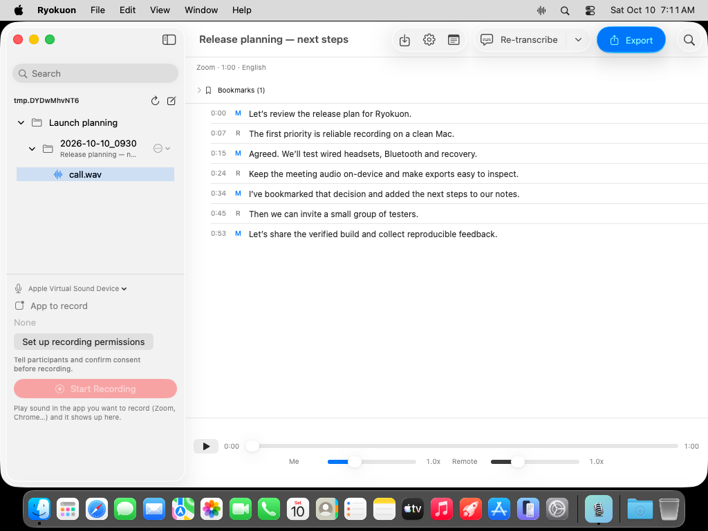

# Ryokuon

**Your meetings, on your Mac.** Record both sides of a call, find what was said, and leave with notes you can use.

Native SwiftUI · On-device transcription · English / 日本語 / 한국어 · No account or subscription

[日本語](docs/README.ja.md) · [한국어](docs/README.ko.md) · [Privacy](PRIVACY.md) · [Contributing](CONTRIBUTING.md)

> **Release preparation:** this branch adds the production distribution path and meeting workspace. A public production build still requires Developer ID signing, Apple notarization and the [hardware acceptance checks](docs/RELEASE.md). Existing 0.1.x downloads do not retroactively receive those guarantees.



Actual macOS app with fictional meeting data.

## What it does

- **Record the call you choose.** Microphone + one selected app, with visible levels and silence warnings. With an external mic, left = you and right = remote. Built-in mic recordings are mixed to mono; this is not multi-person speaker diarization.
- **Turn it into searchable text.** Apple SpeechAnalyzer processes audio on-device. Japanese, Korean and English, with automatic language selection and manual overrides. Queued transcription survives restarting the app.
- **Find the decision.** Search across recording titles, apps, transcripts, notes and bookmarks. Multiple search terms must all match the same meeting.
- **Keep useful context.** Add time-stamped bookmarks during recording or playback. Write meeting notes and include them in Markdown exports.
- **Use your own files.** Import M4A, MP3, WAV or FLAC. Export full recordings or selected ranges to MP3 and Markdown. Browse nested folders without copying their files.
- **Keep the original safe.** Crash-recoverable WAV headers, stopped recording on write/overflow failures, low-space checks and verified lossless FLAC conversion. Playback and transcription stream audio rather than loading an entire meeting into PCM memory.

## Requirements and installation

Apple silicon · macOS 26+ · Xcode 26 / Swift 6.2+ to build from source.

For a production release, download the notarized `Ryokuon.dmg` from [Releases](https://github.com/younnieCutler/ryokuon/releases), open it and drag Ryokuon into Applications. Verify that the release notes identify a notarized build. Keep Gatekeeper enabled.

For development:

```bash
git clone https://github.com/younnieCutler/ryokuon.git
cd ryokuon
export RYOKUON_SIGN_IDENTITY='Apple Development: your identity (TEAMID)'
bash Scripts/bundle.sh
open .build/Ryokuon.app
```

The bundle builder compiles a pinned, static LAME helper, verifies its source checksum, and includes its license, source and build recipe. End users need no Homebrew. For tests outside the bundle, install `lame` with Homebrew and run `bash Scripts/validate.sh`. `RYOKUON_SIGN_IDENTITY=-` makes an ad-hoc development build; it is not a distributable notarized release, and stable signing is recommended for permission persistence.

## A first meeting

1. Open the library. Import and playback work without granting recording permissions.
2. Select **Set up recording permissions** for microphone, app audio and storage access. Notify participants and confirm consent.
3. Play sound in the call app, choose that app, and start recording. Check both meters; a headset helps keep the two sides separate.
4. Add bookmarks for useful moments. Stop and save. Automatic transcription can be turned off in Settings.
5. Select the saved audio file in the library. Click a transcript line or bookmark to hear that moment; add notes and export when ready.

`⌘I` imports audio · `⇧⌘B` bookmarks an active recording · `⇧⌘N` opens notes for the selected meeting.

Auto language selection chooses one language for the recording using a short probe. Mixed-language calls and several speakers on the remote channel need manual review. Download models once while online; installed speech models work locally. Forced sleep stops and saves recording; closing the window keeps the app available in the menu bar.

## Open, local files

Default storage: `~/Documents/ryokuon/<timestamp>/`. Change the root in Settings; existing recordings remain in the old location. Move session folders into project subfolders using Finder.

| File | Contents |
| --- | --- |
| `call.wav` / `call.flac` | Recorded or imported audio; WAV is removed only after verified lossless conversion |
| `transcript.txt` | `startMs\|speaker\|text`, one utterance per line (`M`, `R`, or mono `U`) |
| `raw.json` | Recognized words, time ranges and confidence |
| `session.json` | Stable ID, title, notes, bookmarks, gains, language and transcription state |

These files are portable and work with other tools. Back up the storage folder as you would any important document. Session deletion is permanent and removes its exports too.

```bash
bin/ryokuon list
bin/ryokuon show project/2026-10-10_0930
bin/ryokuon search project/2026-10-10_0930 'release [plan]'
bin/ryokuon range project/2026-10-10_0930 60000 120000
```

The CLI uses the GUI's configured root on macOS; `RYOKUON_ROOT` overrides it for automation. Search treats the keyword literally and rejects paths outside the root. A copy is bundled at `Ryokuon.app/Contents/Resources/ryokuon-cli`.

## Development

[macOS CI](https://github.com/younnieCutler/ryokuon/actions/workflows/ci.yml) runs Swift tests, a release build, bundle signature checks and isolated CLI regression tests. Real microphones, Bluetooth route changes, crash recovery during capture and long-meeting performance remain hardware acceptance tests.

Read [Architecture](docs/ARCHITECTURE.md), [Release checklist](docs/RELEASE.md) and [Contributing](CONTRIBUTING.md). Small, reproducible bug reports and focused PRs are welcome. Do not attach real meeting recordings, transcripts or private business content to public issues.

Ryokuon source is [MIT licensed](LICENSE). The bundled standalone LAME encoder remains LGPL-2.0-or-later; see [Third-party notices](THIRD_PARTY_NOTICES.md).
